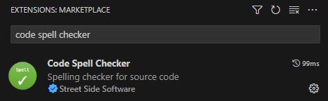
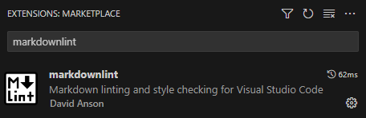
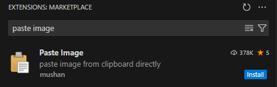
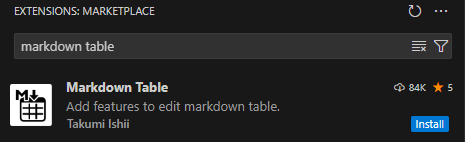

This section provides an overview on installing Visual Studio Code (VSCode) as Markdown editor.

## Navigation

- [Markdown in VSCode](#markdown-in-vscode)
- [Automatic installation](#automatic-installation)
- [Manual installation](#manual-installation)

# Markdown in VSCode

Markdown is the lightweight markup language designed for crafting formatted text using a plain-text editor or any other editor.
One of the most famous editors to use for writing Markdown, is [Visual Studio Code](https://code.visualstudio.com/) (VSCode), as it provides useful extensions that can check for spelling, linting rules, and more directly in the editor.

Before cloning the repository, and open it in VSCode, you need to have it installed.

The next paragraphs provide steps and recommendations that you can follow to install VSCode including the extensions.

# Automatic installation

To install VSCode automatically, you can grab the latest copy of the [Install-VSCode.ps1](https://github.com/PowerShell/vscode-powershell/blob/main/scripts/Install-VSCode.ps1) from GitHub. Save the script locally, and follow the steps below.

1. Open a PowerShell terminal
2. Run the `Install-VSCode.ps1` script in the terminal

```powershell
.\Install-VSCode.ps1 -AdditionalExtensions "streetsidesoftware.code-spell-checker", "davidanson.vscode-markdownlint", "takumii.markdowntable", "mushan.vscode-paste-image" -LaunchWhenDone
```

This will install VSCode with the recommended extensions.

# Manual installation

To install VSCode manually, you can download the software from [here](https://code.visualstudio.com/). Depending on the platform you're working on, run the program that was downloaded and follow the wizard. After you are finished, follow the steps below to install the extensions.

1. Open VSCode
2. Press Ctrl + Shift + X to open the "Extensions" blade
3. Search for Code Spell Checker -> Install

    

4. Search for markdownlint -> Install

    

5. Search for Paste Image -> Install

    

6. Search for Markdown Table -> Install

    
